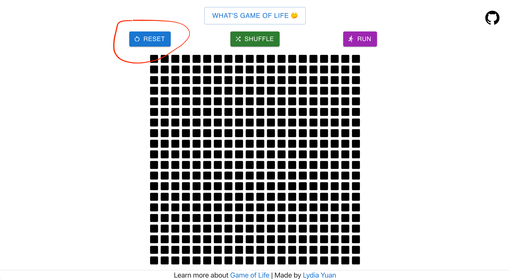
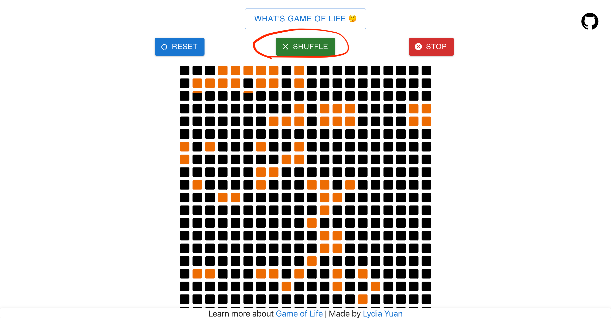
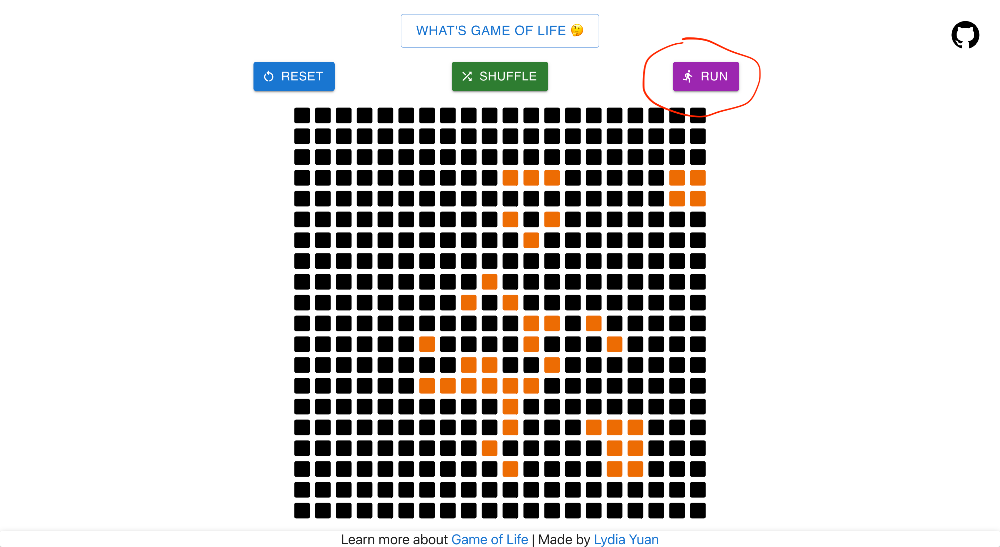
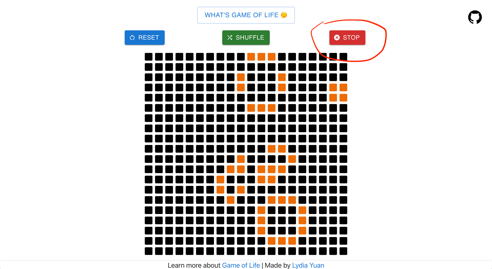

# The most basic Game of Life demo you would ever see

Try it here: [https://yuanruqian.github.io/game-of-life-demo/](https://yuanruqian.github.io/game-of-life-demo/)

## What is [Conway's Game of Life](http://pi.math.cornell.edu/~lipa/mec/lesson6.html)
Click the button to see a short intro & check out the rules

## Reset
Clear the board

## Shuffle
Randomize the cells distribution & keep them iterating

## Run / Stop
The cells iterate at the speed of 200 ms per generation

